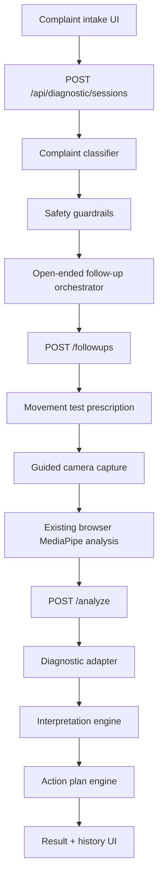

# Guided Movement Diagnostic Architecture

## Architecture shape

The feature is split into small domain services rather than a single controller.

## Responsibilities

- Classifier: maps the intake complaint plus open-ended follow-up answers into `primary_bucket`, `secondary_bucket`, `body_region`, `pain_flag`, severity, side, activity trigger, and confidence.
- Follow-up orchestrator: selects the configurable chatbot prompts `movement_story`, `context_story`, and `safety_story`.
- Prescription engine: maps the refined classification and answers to exactly one movement test.
- Video capture: collects a simple one-angle browser/native-camera clip.
- Analysis adapter: converts existing raw pose outputs into stable diagnostic metrics.
- Interpretation engine: maps metrics and context into safe plain-English contributor statements.
- Action plan engine: returns drills, load modifications, recovery suggestions, retest guidance, and escalation guidance.
- Guardrail service: enforces non-medical language and stop-test messaging.

## Follow-up strategy

V1 uses open-ended answers rather than closed chips. The UI asks one question at a time, sends `answer_type: "open_text"`, and the backend performs deterministic parsing. Negated red-flag language such as "no swelling or numbness" is handled separately from affirmative red-flag language such as "there is swelling and numbness."

## Stable intermediate schema

The diagnostic system depends on `NormalizedDiagnosticMetrics`, not directly on the raw MediaPipe/reporting payload. This keeps future analysis engines or server-side workers interchangeable.

Metrics include:

- `depthScore`
- `kneeTrackingScore`
- `hipControlScore`
- `ankleMobilityIndicator`
- `trunkControlScore`
- `asymmetryIndicator`
- `balanceScore`
- `stabilityScore`
- `shoulderMobilityScore`
- `hingePatternScore`
- `landingControlScore`
- `explosivenessIndicator`
- `tempoControlScore`
- `painBehaviorFlag`
- `analysisConfidence`

## Async strategy

V1 completes analysis in-browser, then posts the compact analysis snapshot to the backend. The API response returns `jobState: "completed"`, while the frontend still uses a processing state with upload/analyze/interpret/build-plan steps. The schema supports later background jobs without changing the user-facing route contract.
